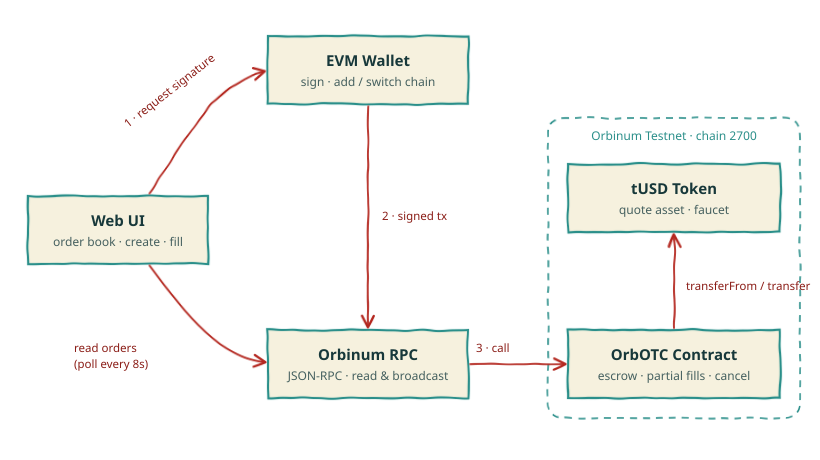

<div align="center">

# ORB.OTC

**A peer-to-peer OTC order book for ORB on the Orbinum testnet.**

Lock funds in escrow · fill orders in one transaction · no custody, no backend.


</div>

> [!WARNING]
> **Testnet only.** ORB and tUSD on this network have no real value. The contracts are unaudited and must not be deployed to mainnet as-is.

---

## Overview

ORB.OTC is a simple OTC board with two columns, **Sell Orders** and **Buy Orders**, showing price, volume and total, with a one-click button to take an order. Matching and custody are handled entirely by a smart contract on [Orbinum](https://github.com/orbinum), a privacy-focused Substrate + EVM (Frontier) Layer 1.

| | Sell Orders | Buy Orders |
|---|---|---|
| **Maker locks** | ORB | tUSD |
| **Maker receives** | tUSD | ORB |
| **Taker action** | Buy ORB | Sell ORB |

## Features

- **On-chain escrow.** Makers deposit into the contract; funds only move on fill or cancel.
- **Partial fills.** Takers can fill any amount up to the remaining size.
- **Cancel anytime.** Unfilled escrow is refunded to the maker.
- **No fees, no admin keys, no upgradeability** in the testnet build.
- **Serverless UI.** The order book is read straight from the chain and refreshes every 8 seconds.
- **Wallet friendly.** One click adds or switches to Orbinum Testnet in any EVM wallet.
- **Built-in faucet** for the tUSD quote token (10,000 tUSD per hour).

## How it works

```
 Maker ── createSellOrder(price) + ORB ──▶ ┌────────────┐
                                           │  OrbOTC    │ ◀── fillSellOrder(id, amount) ── Taker (pays tUSD)
 Maker ── createBuyOrder(price, amount) ─▶ │  escrow    │ ◀── fillBuyOrder(id) + ORB ───── Taker (gets tUSD)
          (tUSD escrowed)                  └────────────┘
                                             cancelOrder(id) → refund
```

**Pricing.** `price` is the number of tUSD base units (6 decimals) per 1 ORB (18 decimals). Amounts are computed with integer math; the payer's side is rounded up, so an order can never be under-funded.

## Architecture

<p align="center">
  
</p>

| Component | Role |
|---|---|
| **Web UI** | React + viem app. Reads the order book through the RPC and builds transactions. Holds no keys and runs no server. |
| **EVM Wallet** | Signs every transaction and adds or switches to chain 2700. |
| **Orbinum RPC** | Public JSON-RPC endpoint used for reads (polled every 8s) and for broadcasting signed transactions. |
| **OrbOTC Contract** | Escrows ORB and tUSD, matches fills, handles partial fills and cancels. |
| **tUSD Token** | Test ERC-20 used as the quote asset, with a public faucet. |

## Network

| | |
|---|---|
| Network | Orbinum Testnet |
| Chain ID | `2700` |
| HTTP RPC | `https://rpc-1.testnet.orbinum.io` |
| WebSocket | `wss://rpc-1.testnet.orbinum.io` |
| Currency | ORB (18 decimals) |
| Explorer | https://explorer.testnet.orbinum.network |
| Faucet | https://faucet.orbinum.network (5 ORB / 24h) |

Reference: [Orbinum build docs](https://docs.orbinum.network/build/get-started).

## Project layout

```
orb-otc/
├── contracts/
│   ├── OrbOTC.sol        # escrow order book
│   └── MockUSD.sol       # tUSD test token + faucet
├── test/OrbOTC.test.ts   # Hardhat tests
├── scripts/deploy.ts     # deploys both contracts, writes web/src/deployment.json
└── web/                  # Vite + React + viem front end
```

## Quick start

**Requirements:** Node.js 18+ and an EVM wallet (MetaMask etc.).

```bash
git clone https://github.com/RHEEUNION/orb-otc.git
cd orb-otc
npm install
npm test
```

### Deploy to the testnet

1. Get testnet ORB for gas from the [faucet](https://faucet.orbinum.network/).
2. Create a `.env` from the template and set a **throwaway, testnet-only** key:

   ```bash
   cp .env.example .env
   # DEPLOYER_KEY=0x...
   ```

3. Deploy:

   ```bash
   npm run deploy:testnet
   ```

   This prints the contract addresses and writes them to `web/src/deployment.json`.

### Run the web app

```bash
cd web
npm install
npm run dev        # development
npm run build      # production build in web/dist
```

## Using the app

1. **Connect Wallet**. The app adds/switches to Orbinum Testnet for you.
2. Grab **ORB** from the Orbinum faucet and **tUSD** from the in-app *Get tUSD* button.
3. Browse the **Order Book** and click *Buy ORB* / *Sell ORB* to fill an order (full or partial), or open **New Order** to post your own.
4. Manage or cancel your open orders under **My Orders**.

## Contract API

| Function | Description |
|---|---|
| `createSellOrder(price)` `payable` | Lock `msg.value` ORB, ask `price` tUSD per ORB |
| `createBuyOrder(price, orbAmount)` | Lock tUSD for `orbAmount` ORB (requires prior `approve`) |
| `fillSellOrder(id, orbAmount)` | Pay tUSD, receive ORB |
| `fillBuyOrder(id)` `payable` | Send ORB as `msg.value`, receive tUSD |
| `cancelOrder(id)` | Maker-only, refunds remaining escrow |
| `getOrders(from, limit)` | Paged read for the UI |

## Roadmap

- [x] Escrow order book with partial fills (testnet)
- [ ] Trade history / tape from `OrderFilled` events
- [ ] Shielded settlement using Orbinum shielded pools (`@orbinum/protocol`, proof-generator)
- [ ] Order expiry and minimum fill size
- [ ] Security audit and mainnet build

## Security notes

- Contracts are **unaudited** and intended for testnet use.
- Never put a real or mainnet private key in `.env`.
- Orders and fills are public EVM transactions today; privacy features depend on the shielded settlement work above.

## License

MIT
